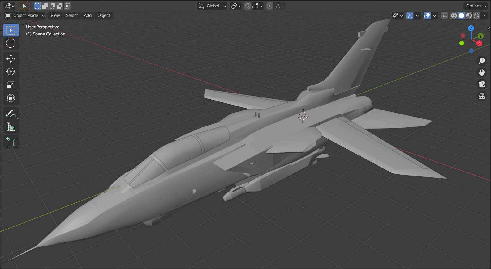

# Ace Combat Assault Horizon Blender Import Script

**Author:** mariokart64n  
**Date:** March 22, 2021  
**Version:** 0.1  

## Table of Contents
1. [Overview](#overview)
2. [Features](#features)
3. [Installation](#installation)
4. [Usage](#usage)
5. [ChangeLog](#changelog)
6. [Acknowledgments](#acknowledgments)

---

## Overview

The **Ace Combat Assault Horizon Blender Import Script** is a Python tool designed to import 3D models from **Ace Combat Assault Horizon** into Blender. Written for **Blender version 2.92.0**, this script leverages memory dump data from the PS3 version of **Ace Combat Infinity** to facilitate the extraction and visualization of game assets within Blender, enabling users to work with hero, NPC, and destroyed aircraft meshes along with their corresponding textures.




---

## Features

- **Import 3D Meshes**: Supports importing hero, NPC, and destroyed aircraft meshes from ACAH.
- **Texture Integration**: Handles DDS DXT4 textures associated with the meshes.
- **Compatibility**: Adapted to work with PS3 memory dumps from Ace Combat Infinity.
- **User-Friendly**: Simple interface within Blender for selecting and importing files.
- **Extendable**: Designed to be modified and extended for additional features and support.

---

## Installation

1. **Clone the Repository**:
    ```bash
    git clone https://github.com/coreynguyen/bpy_ace_combat_assault_horizon_ps3.git
    ```
2. **Download the Script**:
    - Navigate to the cloned repository and locate the Python script file (e.g., `import_acah.py`).

3. **Open Blender**:
    - Launch Blender and switch to the **Scripting** workspace.

4. **Load the Script**:
    - Click on the **New** button to create a new script.
    - Open the downloaded Python script file and copy its contents into the Blender script editor.

---

## Usage

1. **Execute the Script**:
    - In the Blender **Scripting** tab, ensure the script is loaded.
    - Press `ALT + P` or click the **Play** button to run the script.

2. **Import Models**:
    - A file selection dialog will appear upon execution.
    - Select the desired `.fhm` or `.ndxr` file to import the 3D mesh into Blender.

3. **Access Imported Models**:
    - After the initial execution, you can access the file prompt through **File > Import** without needing to rerun the script, until Blender is restarted.

4. **Adjust Settings**:
    - The script includes options like **Guess Vertex Stride** to handle different vertex formats. Adjust these settings as needed based on the imported model's requirements.

---

## ChangeLog

- **2021-03-22**: Initial script creation.
- **2021-03-23**: Adapted the script to work with PS3 memory dumps from Ace Combat Infinity.

---

## Acknowledgments

- **Octave**: For initial research into QDF file unpacking and sharing valuable extraction tools.
- **wood5568**: For insights into the NU Library engine and contributions to related GitHub projects.
- **GreenTrafficLight**: For developing the [Ace Combat Blender Addon](https://github.com/GreenTrafficLight/Ace-Combat-Blender-Addon) and [Macross 30 Blender Addon](https://github.com/GreenTrafficLight/Macross-30-Blender-Addon).
- **enmacderm**: For contributions to understanding the NDP3/NDXR formats and memory dump analysis.
- **ZenHAX Community**: For fostering a collaborative environment for game research and tool development.

---

For more detailed information on game research, format specifications, and related topics, please refer to the [Wiki](https://github.com/coreynguyen/bpy_ace_combat_assault_horizon_ps3/wiki).
